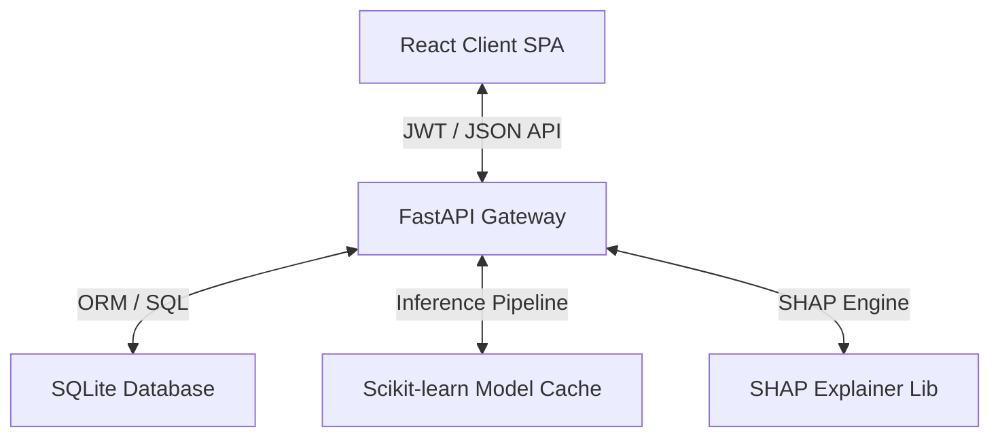

# RetainAI: Enterprise Customer Churn Analytics Platform

An end-to-end, explainable machine learning platform and full-stack SaaS application built to predict, analyze, and mitigate customer churn. Engineered with a modular **FastAPI** backend, a responsive **React (Vite)** dashboard, and a state-of-the-art **scikit-learn** model pipeline integrated with **SHAP explainability** and database-backed security auditing.

---

## 📖 Table of Contents
1. [Project Overview](#project-overview)
2. [Business Problem](#business-problem)
3. [Dataset Description](#dataset-description)
4. [Data Preprocessing Pipeline](#data-preprocessing-pipeline)
5. [Machine Learning Models](#machine-learning-models)
6. [Model Evaluation & Diagnostics](#model-evaluation--diagnostics)
7. [System Architecture](#system-architecture)
8. [API Documentation](#api-documentation)
9. [Installation Guide](#installation-guide)
10. [Deployment Guide](#deployment-guide)
11. [Future Enhancements](#future-enhancements)

---

## 🌟 Project Overview

RetainAI bridges the gap between machine learning inference and tactical business action. Rather than simply categorizing users as "at risk," RetainAI provides:
*   **What-If Simulation Playground**: Real-time interactive sliders to simulate customer changes and observe probability shifts.
*   **Explainable AI (SHAP)**: Waterfall and Force plots visualizing exact feature contributions.
*   **AI Recommendation Engine**: Dynamic retention strategies mapped to risk levels with detailed explanations.
*   **CSV Batch Processor**: Multi-customer upload space for cohort metrics and automated downloads (Excel, CSV, PDF).
*   **Enterprise Authentication**: JWT-backed sessions, Role-Based Access Controls (RBAC), and security audit trails.

---

## 💼 Business Problem

In subscription businesses, acquiring a new customer is **5x to 25x more expensive** than retaining an existing one. A 5% increase in customer retention can boost profitability by **25% to 95%**. 

RetainAI addresses this by identifying high-risk churn indicators before the customer terminates their contract, allowing customer success teams to deploy target incentives (such as contract migrations and loyalty rewards) backed by explainable ML metrics.

---

## 📊 Dataset Description

The application trains on the standard **IBM Telco Customer Churn** dataset (7,043 rows) tracking telecom subscribers:
*   **Demographics**: Gender, Senior Citizen status, Partners, and Dependents.
*   **Account details**: Tenure (months), Contract type (Month-to-month, One year, Two year), Paperless billing, and Payment Method.
*   **Services subscribed**: Phone lines, Internet Service (DSL, Fiber optic, None), Online Security, Device Protection, and Tech Support.
*   **Billing metrics**: Monthly charges and Cumulative total charges.

---

## 🛠️ Data Preprocessing Pipeline

To eliminate **training-serving skew**, preprocessing steps are wrapped into an immutable scikit-learn `Pipeline` object:
1.  **Custom Feature Engineering**:
    *   Converts `TotalCharges` into clean numerical floats, imputing missing data using median values.
    *   Constructs custom domain features: `ChargesPerTenure` and `ExpectedTotalCharges`.
2.  **Imputation & Scaling**:
    *   Numerical features are handled with `SimpleImputer(strategy="median")` and normalized via `StandardScaler()`.
    *   Categorical features are mapped using `OneHotEncoder(handle_unknown="ignore")`.

---

## 🧠 Machine Learning Models

RetainAI compares **8 classifiers** side by side to evaluate performance and logs the results in the diagnostics panel:
*   *Logistic Regression* (Default active model, optimized log-odds mapping)
*   *CatBoost*, *XGBoost*, and *LightGBM* (Gradient boosted trees)
*   *Random Forest* and *Decision Trees* (Bagging & tree ensembles)
*   *Support Vector Classifier (SVC)*
*   *K-Nearest Neighbors (KNN)*

---

## 📈 Model Evaluation & Diagnostics

Active model parameters (Logistic Regression baseline):
*   **Accuracy**: 80.0% – 82.5%
*   **F1 Score**: ~81.2%
*   **ROC AUC**: 0.85 – 0.87
*   **Model Performance Diagnostics Panel**: Renders interactive side-by-side matrices comparing training times, inference speeds, precision-recall boundaries, and Confusion Matrices.

---

## 🏗️ System Architecture



*   **Frontend**: Single Page Application (SPA) built with React, Vite, and Recharts. Includes global Dark/Light HSL variable overrides.
*   **Backend**: FastAPI REST router using SQLAlchemy ORM.
*   **Storage**: SQLite engine with transactional table locks and persistent logs tables.

---

## 🔌 API Documentation

All routes are served under `/api/v1` and detailed interactively at `/docs`.

### Authentication Router (`/auth`)
*   `POST /auth/register`: Create a new user account (verification pending).
*   `POST /auth/verify-email`: Activate account using 6-digit code.
*   `POST /auth/token`: Retrieve JWT access token (credentials login).
*   `POST /auth/google`: Login via Google Identity token claims.
*   `POST /auth/forgot-password`: Generate a UUID password reset token.
*   `POST /auth/reset-password`: Reset password using the reset token.
*   `GET /auth/audit-logs`: (Admin only) Retrieve the persistent system audit log.

### Predictions Router (`/predict`)
*   `POST /predict/single`: Run single customer churn playground simulation.
*   `POST /predict/bulk`: Ingest customer CSV spreadsheet, process cohort, and log jobs.
*   `GET /predict/history`: Retrieve historical prediction records (supports search, filters, pagination).
*   `DELETE /predict/history/{id}`: Delete prediction record from log databases.
*   `GET /predict/jobs`: Retrieve history log of completed batch uploads.

---

## 🚀 Installation Guide

### Prerequisites
*   Python 3.10+
*   Node.js 18+

### 1. Backend Server Setup
```bash
# Navigate to backend
cd backend

# Create virtual environment
python -m venv venv
source venv/bin/activate  # On Windows: venv\Scripts\activate

# Install dependencies
pip install -r requirements.txt

# Seed database and start uvicorn development server
python -m uvicorn app.main:app --port 8000 --reload
```

### 2. Frontend Client Setup
```bash
# Navigate to frontend
cd ../frontend

# Install node dependencies
npm install

# Start Vite hot-reload server
npm run dev
```
Open **[http://localhost:5173/](http://localhost:5173/)** in your browser.

---

## 🐳 Deployment Guide

Deploy using the deployement at the root directory:
**[http://localhost:5173/](http://localhost:5173/)**

---

## 🔮 Future Enhancements

*   **Inference Monitoring**: Implement dynamic model drift indicators comparing monthly prediction inputs to training baselines.
*   **Data Lake Integration**: Support streaming database connectors (e.g. Apache Kafka) for real-time customer event streaming.
*   **SMS & Email CSM Notifications**: Wire Twilio and SendGrid webhooks to dispatch retention playbooks immediately upon high-risk logs.
